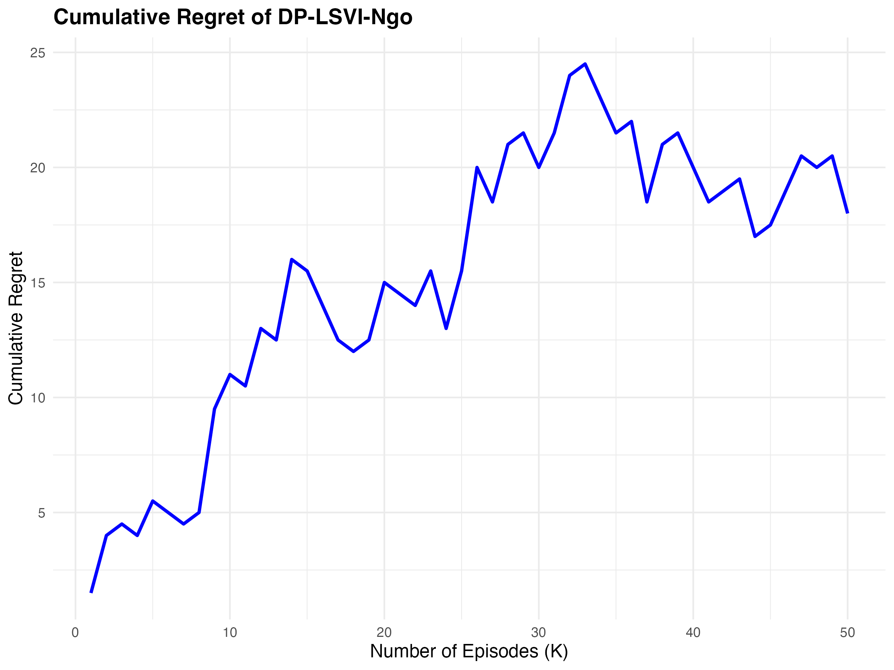
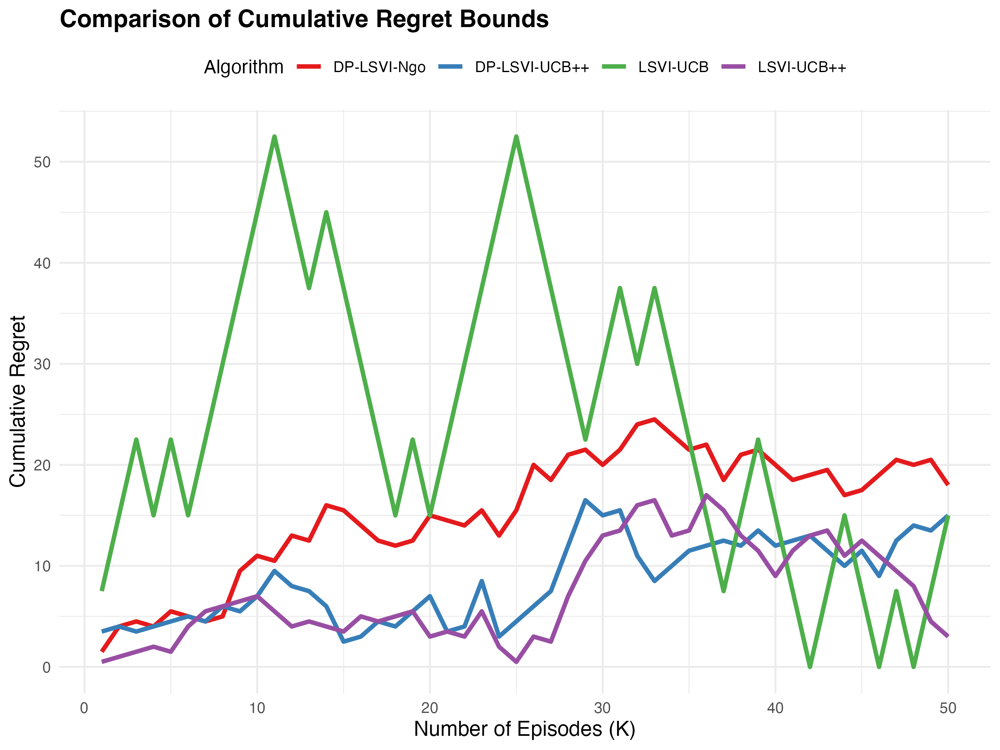

# Introduction to DiffPrivateModelEval

The `DiffPrivateModelEval` R package provides tools for evaluating state-of-the-art algorithms 
for linear Markov Decision Processes (MDPs), including **DP-LSVI-UCB++**, a new state-of-the-art 
algorithm with **Joint Differential Privacy (JDP) guarantees**. These algorithms are designed 
to achieve efficient regret bounds while preserving privacy.

This vignette introduces the key algorithms and their implementations:

1. **DP-LSVI-Ngo**: Differentially private algorithm for linear MDPs.
2. **LSVI-UCB**: A classic benchmark algorithm for linear MDPs.
3. **DP-LSVI-UCB++**: A differentially private and regret-efficient algorithm for linear MDPs.
4. **LSVI-UCB++**: Non-private variant of LSVI-UCB with enhanced regret bounds.

The package also provides tools to visualize cumulative regret and compare multiple algorithms.

---

## Installation

To install the package from GitHub, use the following commands:

```r
# Install devtools if not already installed
install.packages("devtools")

# Install DiffPrivateModelEval from GitHub
devtools::install_github("sharansahu/DiffPrivateModelEval")
```

## Features and Functionality

### Key Algorithms

1. **`create_DP_LSVI_Ngo`**
    - Implements a differentially private version of the LSVI algorithm.
    - Previous state-of-the-art JDP algorithm for linear MDPs

2. **`create_LSVI_UCB`**
    - First proposed algorithm for efficient exploration-exploitation for linear MDPs. This algorithm is non-privatized and is privatized by DP-LSVI-Ngo

3. **`create_DP_LSVI_UCB_PlusPlus`**
    - Implements a differentially private version of LSVI-UCB++
    - New state-of-the-art JDP algorithm for linear MDPs

4. **`create_LSVI_UCB_PlusPlus`**
    - Newly proposed algorithm that improves on LSVI-UCB by achieving near minimax optimal regret bound for linear MDPs. This algorithm is non-privatized and is privatized by DP-LSVI-UCB++
    
# Key Algorithms and Modifiable Parameters
Below, we have listened the available algorithms and their modifiable paramters. Note that we included DP-LSVI-Luyo for completeness and comparison, but it was improved on by DP-LSVI-Ngo

1. **`create_DP_LSVI_Ngo`**
    - H: Horizon length (default: 10)
    - K: Number of episodes (default: 100)
    - num_actions: Number of actions (default: 100)
    - p: Privacy failure probability (default: 0.01)
    - rho: Privacy parameter (default: 10.0)
    - C: Algorithm-specific scaling constant (default: 2.0)
    - seed: Random seed for reproducibility (default: 0)
    - action_seed: Seed for action generation (default: 42)

2. **`create_LSVI_UCB`**
    - H: Horizon length (default: 10)
    - K: Number of episodes (default: 100)
    - num_actions: Number of actions (default: 100)
    - delta: Confidence parameter (default: 0.01)
    - lambda_reg: Regularization parameter (default: 1.0)
    - seed: Random seed for reproducibility (default: 0)
    - action_seed: Seed for action generation (default: 42)

3. **`create_DP_LSVI_UCB_PlusPlus`**
    - H: Horizon length (default: 10)
    - K: Number of episodes (default: 100)
    - num_actions: Number of actions (default: 100)
    - delta: Confidence parameter (default: 0.01)
    - rho: Privacy parameter (default: 10.0)
    - seed: Random seed for reproducibility (default: 0)
    - action_seed: Seed for action generation (default: 42)

4. **`create_LSVI_UCB_PlusPlus`**
    - H: Horizon length (default: 10)
    - K: Number of episodes (default: 100)
    - num_actions: Number of actions (default: 100)
    - delta: Confidence parameter (default: 0.01)
    - seed: Random seed for reproducibility (default: 0)
    - action_seed: Seed for action generation (default: 42)

5. **`create_DP_LSVI_Luyo`**
    - H: Horizon length (default: 10)
    - K: Number of episodes (default: 100)
    - num_actions: Number of actions (default: 100)
    - delta: Confidence parameter (default: 0.01)
    - eps: Privacy parameter (default: 10.0)
    - p: Privacy failure probability (default: 0.05)
    - seed: Random seed for reproducibility (default: 0)
    - action_seed: Seed for action generation (default: 42)

### Visualization Tools

The package includes functions to plot cumulative regret for individual algorithms and compare the regret performance across multiple algorithms:

1. **`plot_regret`**: Plots the cumulative regret for a single algorithm.
2. **`plot_multiple_algos`**: Compares cumulative regret across multiple algorithms.

---

## Example Usage

### Setup and Running Algorithms

Here’s an example demonstrating the use of the package to run and compare the algorithms:

```r
library(DiffPrivateModelEval)
library(ggplot2)

# Create algorithm instances
dp_lsvi_ngo <- create_DP_LSVI_Ngo(H = 15, K = 50)
lsvi_ucb <- create_LSVI_UCB(H = 15, K = 50)
dp_lsvi_ucb_plusplus <- create_DP_LSVI_UCB_PlusPlus(H = 15, K = 50)
lsvi_ucb_plusplus <- create_LSVI_UCB_PlusPlus(H = 15, K = 50)

# Run the algorithms
dp_lsvi_ngo$run()
lsvi_ucb$run()
dp_lsvi_ucb_plusplus$run()
lsvi_ucb_plusplus$run()
```

### Visualizing Performance

#### Plotting Cumulative Regret for a Single Algorithm

To visualize the cumulative regret for a single algorithm:

```r
# Plot cumulative regret for DP-LSVI-Ngo
plot_regret(dp_lsvi_ngo)
```

```{r, echo=FALSE, out.width="75%"}

```

#### Comparing Multiple Algorithms

To compare the performance of multiple algorithms:

```r
# Compare cumulative regret across algorithms
plot_multiple_algos(list(dp_lsvi_ngo, lsvi_ucb, dp_lsvi_ucb_plusplus, lsvi_ucb_plusplus))
```

```{r, echo=FALSE, out.width="80%"}

```

The resulting plot will show the cumulative regret of all four algorithms, allowing users to 
compare their performance visually.

---

## Conclusion

The `DiffPrivateModelEval` package provides a comprehensive toolkit for evaluating and comparing 
cutting-edge algorithms for linear MDPs, with a special focus on privacy-preserving methods. By 
using the examples above, you can easily integrate these methods into your own research and 
analysis workflows.

For more details, refer to the function documentation and explore the source code on the:
\fcolorbox{green}{white}{\href{https://github.com/sharansahu/DiffPrivateModelEval}{GitHub repository}}


